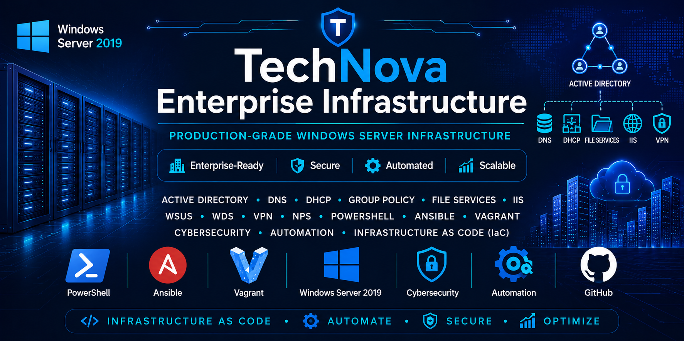

# AutoCloud Enterprise

## Automated Private Cloud Infrastructure


<p align="center">
  
</p>

---

# 📖 Project Overview

AutoCloud Enterprise is a **production-inspired Linux infrastructure project** designed to demonstrate real-world **Linux System Administration**, **Infrastructure as Code (IaC)**, **DevOps automation**, **private cloud deployment**, **identity management**, **enterprise storage**, **monitoring**, and **security hardening**.

The entire infrastructure is automatically deployed using **Vagrant** and **Ansible**, while modern applications are delivered through **Docker Compose**.

This project simulates the IT infrastructure of a medium-sized enterprise and follows industry best practices for automation, documentation, security, and maintainability.

---

# 📚 Table of Contents

- [Project Overview](#-project-overview)
- [Objectives](#-objectives)
- [Key Features](#-key-features)
- [Architecture Overview](#-architecture-overview)
- [Technology Stack](#-technology-stack)
- [Repository Structure](#-repository-structure)
- [Documentation](#-documentation)
- [Deployment Workflow](#-deployment-workflow)
- [Project Roadmap](#-project-roadmap)
- [Skills Demonstrated](#-skills-demonstrated)
- [Screenshots](#-screenshots)
- [License](#-license)

---

# 🎯 Objectives

The goal of this project is to design, automate, deploy, secure, monitor, and maintain a realistic enterprise infrastructure using Infrastructure as Code principles.

The project demonstrates how to:

- Provision infrastructure automatically
- Configure Linux servers with Ansible
- Deploy containerized services
- Manage enterprise identity
- Configure centralized storage
- Monitor infrastructure health
- Apply security hardening
- Automate backups
- Validate infrastructure using automated tests

---

# 🚀 Key Features

- Infrastructure as Code (IaC)
- Automated Virtual Machine Provisioning
- Enterprise Linux Administration
- Configuration Management with Ansible
- Private Cloud Platform
- Docker & Docker Compose
- Centralized Identity Management
- Enterprise Storage (LVM + NFS)
- Infrastructure Monitoring
- Security Hardening
- Backup & Disaster Recovery
- Automated Infrastructure Validation

---

# 🏗️ Architecture Overview

The infrastructure consists of four machines.

| Machine | Operating System | Purpose |
|----------|------------------|----------|
| Automation Workstation | Host Machine | Vagrant & Ansible Control Node |
| cloud01 | Ubuntu Server | Private Cloud Platform |
| idm01 | Ubuntu Server | Identity Management & Storage |
| monitor01 | Ubuntu Server | Monitoring & Security |
| client01 | Windows | Employee Workstation |

---

# 🛠 Technology Stack

| Category | Technologies |
|-----------|--------------|
| Operating System | Ubuntu Server |
| Virtualization | VirtualBox, Vagrant |
| Automation | Ansible |
| Containers | Docker, Docker Compose |
| Cloud Platform | Nextcloud |
| Reverse Proxy | Nginx |
| Database | MariaDB |
| Cache | Redis |
| Identity Management | FreeIPA |
| Storage | NFS, LVM |
| Monitoring | Prometheus, Grafana |
| Security | Wazuh, Fail2Ban, Auditd |
| Version Control | Git & GitHub |

---

# 📂 Repository Structure

```text
AutoCloud-Enterprise/
│
├── assets/
│   └── images/
│       ├── banner.png
│       ├── architecture.png
│       └── dashboards/
│
├── ansible/
│   ├── inventory/
│   ├── roles/
│   └── site.yml
│
├── docker/
│
├── documentation/
│   ├── architecture.md
│   ├── network.md
│   ├── installation.md
│   ├── security.md
│   ├── backup.md
│   └── troubleshooting.md
│
├── diagrams/
│
├── scripts/
│
├── tests/
│
├── screenshots/
│
├── Vagrantfile
│
└── README.md
```

---

# 📖 Documentation

| Document | Description |
|----------|-------------|
| 📐 [Architecture](documentation/architecture.md) | Infrastructure architecture, server roles, and design decisions |
| 🌐 [Network Design](documentation/network.md) | Network topology, IP addressing, DNS, and communication flow |
| 🚀 [Installation Guide](documentation/installation.md) | Deployment instructions *(Coming Soon)* |
| 🔒 [Security Guide](documentation/security.md) | Security hardening and best practices *(Coming Soon)* |
| 💾 [Backup & Recovery](documentation/backup.md) | Backup strategy and disaster recovery *(Coming Soon)* |
| 🛠 [Troubleshooting Guide](documentation/troubleshooting.md) | Common issues and solutions *(Coming Soon)* |

---

# 🚀 Deployment Workflow

Clone the repository:

```bash
git clone https://github.com/<username>/AutoCloud-Enterprise.git
```

Enter the project directory:

```bash
cd AutoCloud-Enterprise
```

Provision the infrastructure:

```bash
vagrant up
```

Deploy and configure the environment:

```bash
ansible-playbook -i ansible/inventory/hosts.yml ansible/site.yml
```

After deployment, the complete infrastructure will be ready for use.

---

# 🗺️ Project Roadmap

- [x] Phase 1 — Project Planning & Architecture
- [ ] Phase 2 — Vagrant Infrastructure
- [ ] Phase 3 — Network Configuration
- [ ] Phase 4 — Ansible Base Configuration
- [ ] Phase 5 — Linux Administration
- [ ] Phase 6 — Docker Installation
- [ ] Phase 7 — Nextcloud Deployment
- [ ] Phase 8 — Identity Management
- [ ] Phase 9 — Enterprise Storage
- [ ] Phase 10 — Monitoring Platform
- [ ] Phase 11 — Security Hardening
- [ ] Phase 12 — Backup & Disaster Recovery
- [ ] Phase 13 — Infrastructure Testing
- [ ] Phase 14 — Documentation
- [ ] Phase 15 — GitHub Actions CI
- [ ] Phase 16 — Final Project Release

---

# 💼 Skills Demonstrated

This project demonstrates practical experience in:

- Linux System Administration
- Infrastructure as Code (IaC)
- Configuration Management
- Virtualization
- Docker & Containerization
- Enterprise Networking
- Identity & Access Management
- Storage Administration
- Monitoring & Observability
- Security Hardening
- Backup & Recovery
- Automation
- DevOps Practices
- Documentation

---

# 📸 Screenshots

Project screenshots will be added throughout development.

Examples include:

- Infrastructure Diagram
- Virtual Machines
- Nextcloud Dashboard
- Grafana Dashboards
- Wazuh Dashboard
- Terminal Automation
- Ansible Playbook Execution
- Backup & Restore Process

---

# 🤝 Contributing

Contributions, suggestions, and improvements are welcome.

If you discover a bug or have an idea for enhancement, feel free to open an issue or submit a pull request.

---

# 📄 License

This project is licensed under the MIT License.
