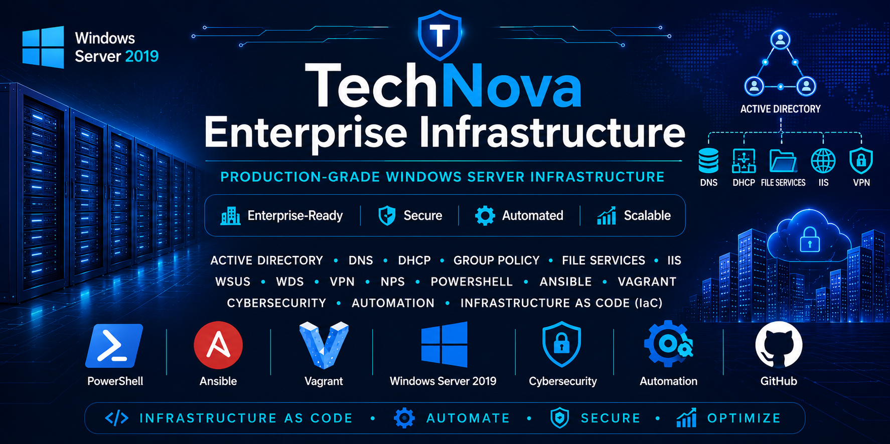
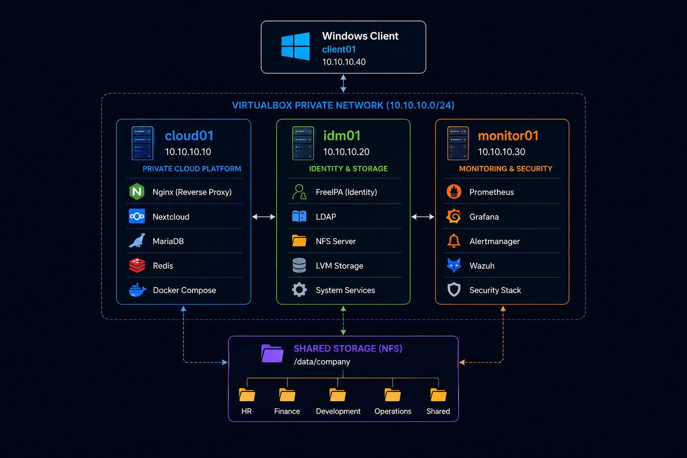
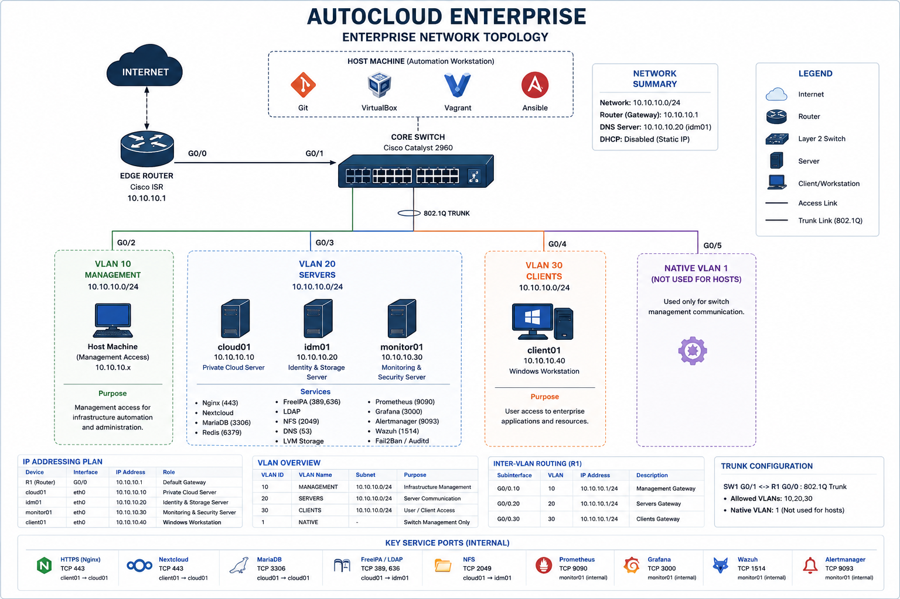

# AutoCloud Enterprise

## Automated Private Cloud Infrastructure


<p align="center">
  
</p>

---

## 📖 Project Overview

AutoCloud Enterprise is a **production-inspired private cloud infrastructure project** designed to demonstrate practical skills in:

* Linux System Administration
* Infrastructure as Code (IaC)
* DevOps automation
* Private cloud deployment
* Containerization
* Identity management
* Enterprise storage
* Infrastructure monitoring
* Security hardening
* Backup and disaster recovery

The infrastructure is provisioned using **Vagrant and VirtualBox**, while server configuration is automated using **Ansible**.

Docker Engine and Docker Compose are deployed through Ansible on the servers that require container workloads.

The project is developed incrementally through clearly defined implementation phases, with each phase introducing and validating a specific infrastructure capability.

---

## 📚 Table of Contents

* [Project Overview](#-project-overview)
* [Objectives](#-objectives)
* [Key Features](#-key-features)
* [Architecture Overview](#-architecture-overview)
* [Technology Stack](#-technology-stack)
* [Repository Structure](#-repository-structure)
* [Documentation](#-documentation)
* [Deployment Workflow](#-deployment-workflow)
* [Project Roadmap](#-project-roadmap)
* [Current Project Status](#-current-project-status)
* [Skills Demonstrated](#-skills-demonstrated)
* [Screenshots](#-screenshots)
* [Contributing](#-contributing)
* [License](#-license)

---

## 🎯 Objectives

The goal of this project is to design, automate, deploy, secure, monitor, and maintain a realistic enterprise infrastructure using Infrastructure as Code principles.

The project demonstrates how to:

* Provision infrastructure automatically
* Configure Linux servers with Ansible
* Deploy containerized services
* Manage enterprise identity
* Configure centralized storage
* Monitor infrastructure health
* Apply security hardening
* Automate backups
* Validate infrastructure using automated tests
* Document infrastructure and operational procedures

---

## 🚀 Key Features

* Infrastructure as Code (IaC)
* Automated Virtual Machine Provisioning
* Enterprise Linux Administration
* Configuration Management with Ansible
* Docker Engine
* Docker Compose
* Private Cloud Platform
* Centralized Identity Management
* Enterprise Storage using LVM and NFS
* Infrastructure Monitoring
* Security Hardening
* Backup & Disaster Recovery
* Automated Infrastructure Validation

---

## 🏗️ Architecture Overview

The project uses a Windows/WSL automation workstation to provision and manage multiple Ubuntu Server virtual machines.

| Machine                | Operating System    | IP Address    | Purpose                            |
| ---------------------- | ------------------- | ------------- | ---------------------------------- |
| Automation Workstation | Windows 11 + WSL    | —             | Vagrant & Ansible Control Node     |
| `cloud01`              | Ubuntu Server 24.04 | `10.10.10.10` | Private Cloud & Docker Host        |
| `idm01`                | Ubuntu Server 24.04 | `10.10.10.20` | Identity Management & Storage      |
| `monitor01`            | Ubuntu Server 24.04 | `10.10.10.30` | Monitoring, Security & Docker Host |
| `client01`             | Windows             | Planned       | Employee Workstation               |

### Server Responsibilities

```text
┌──────────────────────────────────────────────────────────────┐
│                 AutoCloud Enterprise                         │
├───────────────────────┬───────────────────────┬──────────────┤
│ cloud01               │ idm01                 │ monitor01    │
│ 10.10.10.10           │ 10.10.10.20           │ 10.10.10.30  │
│                       │                       │              │
│ Private Cloud         │ Identity Management   │ Monitoring   │
│ Docker                │ FreeIPA / LDAP        │ Security     │
│ Docker Compose        │ NFS / LVM             │ Docker       │
│ Nextcloud (planned)   │                       │ Prometheus   │
│                       │                       │ Grafana      │
│                       │                       │ Wazuh        │
└───────────────────────┴───────────────────────┴──────────────┘
```

Docker is intentionally deployed only on:

```text
cloud01
monitor01
```

`idm01` is reserved for identity and storage services and does not run Docker.

### Architecture Diagram

<p align="center">
  
</p>

### Network Topology

<p align="center">
  
</p>

For more information, see the [Network Design](documentation/network.md) documentation.

---

## 🛠 Technology Stack

| Category            | Technologies                  |
| ------------------- | ----------------------------- |
| Operating System    | Ubuntu Server 24.04           |
| Virtualization      | VirtualBox, Vagrant           |
| Automation          | Ansible                       |
| Containers          | Docker Engine, Docker Compose |
| Cloud Platform      | Nextcloud                     |
| Reverse Proxy       | Nginx                         |
| Database            | MariaDB                       |
| Cache               | Redis                         |
| Identity Management | FreeIPA                       |
| Storage             | NFS, LVM                      |
| Monitoring          | Prometheus, Grafana           |
| Security            | Wazuh, Fail2Ban, Auditd       |
| Version Control     | Git & GitHub                  |

> The project is implemented incrementally. Technologies such as Nextcloud, FreeIPA, NFS, Prometheus, Grafana, Wazuh and other services belong to later implementation phases unless explicitly marked as completed.

---

## 📂 Repository Structure

```text
AutoCloud-Enterprise/
│
├── assets/
│   └── images/
│       ├── banner.png
│       ├── architecture.png
│       ├── network-topology.png
│       └── dashboards/
│
├── ansible/
│   ├── ansible.cfg
│   ├── group_vars/
│   │   └── all.yml
│   ├── host_vars/
│   ├── inventory/
│   │   └── hosts.yml
│   ├── roles/
│   │   ├── common/
│   │   ├── linux_admin/
│   │   └── docker/
│   │       ├── defaults/
│   │       ├── handlers/
│   │       ├── tasks/
│   │       ├── vars/
│   │       └── README.md
│   ├── requirements.yml
│   └── site.yml
│
├── docker/
│
├── documentation/
│   ├── architecture.md
│   ├── network.md
│   ├── installation.md
│   ├── security.md
│   ├── backup.md
│   ├── phase-5-linux-administration.md
│   ├── phase-6-docker.md
│   └── troubleshooting.md
│
├── diagrams/
│
├── scripts/
│
├── tests/
│
├── screenshots/
│
├── Vagrantfile
│
└── README.md
```

> Per-server IP and role information is defined in the Ansible inventory and group variables. The `docker` role is applied only to the designated Docker hosts.

---

## 📖 Documentation

| Document                                                     | Description                                                                                         |
| ------------------------------------------------------------ | --------------------------------------------------------------------------------------------------- |
| 📐 [Architecture](documentation/architecture.md)             | Infrastructure architecture and server roles                                                        |
| 🌐 [Network Design](documentation/network.md)                | Network topology, IP addressing and communication                                                   |
| 🚀 [Installation Guide](documentation/installation.md)       | Project installation and deployment                                                                 |
| 🐧 Phase 5 — Linux Administration                            | Linux baseline, users, SSH, firewall, permissions, storage, services, logs and monitoring           |
| 🐳 Phase 6 — Docker Engine Installation                      | Docker Engine, Docker Compose, Docker networking, Docker security validation and Ansible automation |
| 🔒 [Security Guide](documentation/security.md)               | Security hardening and best practices                                                               |
| 💾 [Backup & Recovery](documentation/backup.md)              | Backup strategy and disaster recovery                                                               |
| 🛠 [Troubleshooting Guide](documentation/troubleshooting.md) | Common issues and solutions                                                                         |

---

## 🚀 Deployment Workflow

### 1. Clone the repository

```bash
git clone https://github.com/WaelBalhoudi/AutoCloud-Enterprise.git
```

### 2. Enter the project directory

```bash
cd AutoCloud-Enterprise
```

### 3. Provision the virtual machines

```bash
vagrant up
```

This currently provisions:

```text
cloud01    → 10.10.10.10
idm01      → 10.10.10.20
monitor01  → 10.10.10.30
```

### 4. Configure the Ansible environment

Because the project is currently located on a Windows-mounted WSL filesystem, Ansible may not automatically load the repository `ansible.cfg`.

From the project root:

```bash
export ANSIBLE_CONFIG="$PWD/ansible/ansible.cfg"
```

Verify:

```bash
echo "$ANSIBLE_CONFIG"
```

### 5. Test Ansible connectivity

```bash
ansible all -i ansible/inventory/hosts.yml -m ping
```

Expected:

```text
cloud01    → SUCCESS
idm01      → SUCCESS
monitor01  → SUCCESS
```

### 6. Install required Ansible collections

```bash
ansible-galaxy collection install -r ansible/requirements.yml
```

### 7. Validate the playbook syntax

```bash
ansible-playbook ansible/site.yml --syntax-check
```

### 8. Deploy the infrastructure configuration

```bash
ansible-playbook ansible/site.yml
```

The playbook currently applies:

#### Common Infrastructure

* Hostname configuration
* Package management
* Timezone and time synchronization
* `/etc/hosts` configuration
* Enterprise directory structure
* Custom MOTD
* Common system configuration

#### Linux Administration

* User and group management
* SSH administration
* UFW firewall
* File permissions and ownership
* Storage and disk information
* System service validation
* Log management
* System resource monitoring

#### Docker Infrastructure

Docker is automatically installed only on the designated Docker hosts:

```text
cloud01
monitor01
```

The Docker role configures:

* Docker Engine
* Docker CLI
* containerd
* Docker Buildx
* Docker Compose plugin
* Docker service
* Docker group configuration
* Docker Unix socket validation
* Docker networking validation
* Docker daemon validation
* Docker Compose validation
* `hello-world` container validation

`idm01` does not receive the Docker role because it is reserved for identity and storage services.

### 9. Validate the deployment

```bash
ansible all -i ansible/inventory/hosts.yml -m ping
```

Check Docker hosts:

```bash
ansible docker_hosts -i ansible/inventory/hosts.yml -m shell -a "docker --version"
```

Check Docker Compose:

```bash
ansible docker_hosts -i ansible/inventory/hosts.yml -m shell -a "docker compose version"
```

---

## 🗺️ Project Roadmap

* [x] Phase 1 — Project Planning & Architecture
* [x] Phase 2 — Enterprise Network Design
* [x] Phase 3 — Infrastructure Provisioning & Networking
* [x] Phase 4 — Ansible Base Configuration
* [x] Phase 5 — Linux Administration
* [x] Phase 6 — Docker Engine Installation
* [ ] Phase 7 — Private Cloud Deployment (Nextcloud)
* [ ] Phase 8 — Identity Management
* [ ] Phase 9 — Enterprise Storage
* [ ] Phase 10 — Monitoring & Observability
* [ ] Phase 11 — Security Hardening
* [ ] Phase 12 — Backup & Disaster Recovery
* [ ] Phase 13 — Infrastructure Testing
* [ ] Phase 14 — Documentation Finalization
* [ ] Phase 15 — GitHub Actions CI/CD
* [ ] Phase 16 — Project Release

---

## 📈 Current Project Status

### Current Phase

**Phase 6 — Docker Engine Installation ✅**

### Completed

#### Phase 1 — Project Planning & Architecture

* ✅ Enterprise architecture design
* ✅ Server role definition
* ✅ Infrastructure planning

#### Phase 2 — Enterprise Network Design

* ✅ Network topology
* ✅ IP addressing
* ✅ Server communication design
* ✅ Private network design

#### Phase 3 — Infrastructure Provisioning & Networking

* ✅ Vagrant configuration
* ✅ VirtualBox infrastructure
* ✅ Ubuntu Server 24.04 virtual machines
* ✅ Static IP addressing
* ✅ SSH connectivity

#### Phase 4 — Ansible Base Configuration

* ✅ Ansible inventory
* ✅ Ansible common role
* ✅ Hostname configuration
* ✅ Common package installation
* ✅ Timezone configuration
* ✅ Time synchronization
* ✅ `sysadmins` group
* ✅ `automation` user
* ✅ Enterprise directory structure
* ✅ `/etc/hosts` configuration
* ✅ Custom MOTD
* ✅ SSH service configuration
* ✅ Infrastructure validation

#### Phase 5 — Linux Administration

* ✅ Linux baseline and system information
* ✅ User and privilege management
* ✅ SSH configuration audit
* ✅ UFW firewall
* ✅ File permissions and ownership
* ✅ Storage and disk inventory
* ✅ System service management
* ✅ System log management
* ✅ System resource monitoring
* ✅ Ansible-based validation

#### Phase 6 — Docker Engine Installation

* ✅ Docker repository prerequisites
* ✅ Docker official APT repository
* ✅ Docker Engine installation
* ✅ Docker CLI installation
* ✅ containerd installation
* ✅ Docker Buildx installation
* ✅ Docker Compose plugin
* ✅ Docker service enabled and running
* ✅ `automation` user Docker group configuration
* ✅ Docker Unix socket validation
* ✅ Docker daemon validation
* ✅ Docker network validation
* ✅ Docker Compose validation
* ✅ `hello-world` container validation
* ✅ Ansible Docker role
* ✅ Docker hosts separated from identity/storage infrastructure
* ✅ Ansible syntax validation
* ✅ Successful deployment across Docker hosts

### Current Infrastructure

| Server      | IP Address    | Role                  | Docker | Status  |
| ----------- | ------------- | --------------------- | ------ | ------- |
| `cloud01`   | `10.10.10.10` | Private Cloud         | ✅      | ✅ Ready |
| `idm01`     | `10.10.10.20` | Identity & Storage    | ❌      | ✅ Ready |
| `monitor01` | `10.10.10.30` | Monitoring & Security | ✅      | ✅ Ready |

### Phase 6 Validation

```text
Docker Hosts:       2
Docker Hosts Ready: 2/2

cloud01:
  Docker:           ✅
  Docker Compose:   ✅
  Docker daemon:    ✅
  Docker networking: ✅
  Hello World:      ✅

monitor01:
  Docker:           ✅
  Docker Compose:   ✅
  Docker daemon:    ✅
  Docker networking: ✅
  Hello World:      ✅

idm01:
  Docker:           ❌ Not required
  Identity/Storage:  ✅
```

### Next Phase

**Phase 7 — Private Cloud Deployment (Nextcloud)**

The next phase will use the Docker infrastructure established during Phase 6 to deploy the private cloud platform on `cloud01`.

---

## 💼 Skills Demonstrated

This project demonstrates practical experience in:

* Linux System Administration
* Infrastructure as Code
* Ansible Configuration Management
* Virtualization
* Vagrant
* Enterprise Networking
* SSH Administration
* Linux Package Management
* User and Group Management
* Time Synchronization
* File Permissions and Ownership
* Filesystem and Storage Administration
* Firewall Configuration
* System Service Management
* Log Management
* System Resource Monitoring
* Docker Engine Administration
* Docker Compose
* Container Networking
* Container Infrastructure Automation
* Infrastructure Validation
* Identity & Access Management
* Monitoring & Observability
* Security Hardening
* Backup & Recovery
* DevOps Practices
* Technical Documentation

---

## 📸 Screenshots

Screenshots are captured throughout the project to document infrastructure deployment and configuration.

### Phase 4 — Ansible Base Configuration

Recommended evidence:

* Ansible project structure
* Ansible inventory
* Ansible connectivity test
* Successful Ansible playbook execution
* Base configuration validation
* Server login and MOTD
* Enterprise directory structure

### Phase 5 — Linux Administration

Recommended evidence:

* Linux baseline information
* User and privilege validation
* SSH configuration audit
* UFW firewall status
* Enterprise directory permissions
* Storage and filesystem information
* System service validation
* Journal/log validation
* Resource monitoring
* Successful Phase 5 deployment

### Phase 6 — Docker Engine Installation

Recommended evidence:

* Docker role structure
* Docker installation through Ansible
* Docker Engine version
* Docker Compose version
* Docker service status
* Docker network configuration
* Docker Unix socket validation
* `docker info` validation
* Successful `hello-world` container execution
* Successful Ansible playbook execution
* Docker hosts configuration
* Verification that `idm01` does not run Docker

Additional screenshots will be added as future phases are completed.

---

## 🤝 Contributing

Contributions, suggestions, and improvements are welcome.

If you discover a bug or have an idea for an enhancement, feel free to open an issue or submit a pull request.

---

## 📄 License

This project is licensed under the MIT License.
