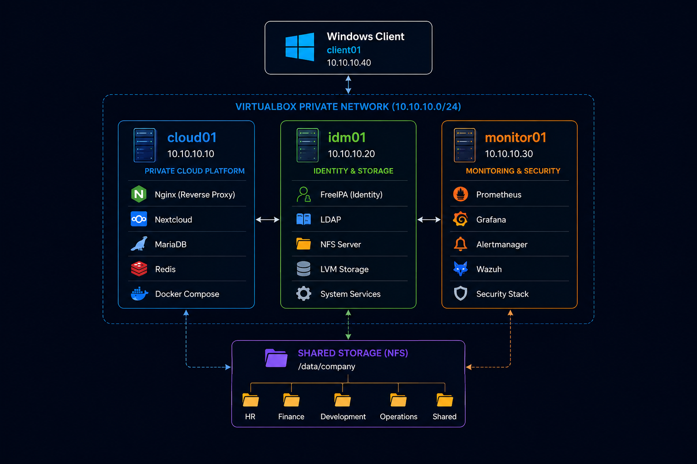

# Enterprise Architecture

## Overview

AutoCloud Enterprise is a production-inspired private cloud infrastructure that demonstrates modern Linux system administration, Infrastructure as Code (IaC), DevOps automation, enterprise storage, identity management, monitoring, and cybersecurity best practices.

The project simulates the infrastructure of a medium-sized organization where every component is provisioned, configured, and maintained through automation. Rather than focusing on individual technologies, the project emphasizes how enterprise services work together to deliver a secure, reliable, and maintainable infrastructure.

The deployment process is fully reproducible using Vagrant for virtual machine provisioning, Ansible for configuration management, and Docker Compose for application deployment.

---

# Architecture Diagram

<p align="center">
    
</p>

---

# Architecture Principles

The infrastructure has been designed according to the following engineering principles.

## Infrastructure as Code

Every infrastructure component is created and configured through code to ensure consistency, repeatability, and version control.

---

## Automation First

Manual configuration is minimized. Server provisioning, software installation, service configuration, and validation are automated using Ansible.

---

## Separation of Responsibilities

Each virtual machine has a dedicated purpose, reducing complexity and improving maintainability.

---

## Security by Default

Security controls are integrated into the deployment process, including SSH hardening, firewall configuration, intrusion prevention, and system auditing.

---

## Reproducibility

The complete environment can be recreated from an empty host using only the project repository and a small number of deployment commands.

---

## Documentation-Driven Development

Infrastructure documentation evolves alongside the implementation to ensure that every architectural decision is traceable and understandable.

---

# Infrastructure Overview

The infrastructure consists of one management workstation and four virtual machines.

| Component    | Operating System | Primary Role           |
| ------------ | ---------------- | ---------------------- |
| Host Machine | Windows/Linux    | Automation Workstation |
| cloud01      | Ubuntu Server    | Private Cloud Platform |
| idm01        | Ubuntu Server    | Identity & Storage     |
| monitor01    | Ubuntu Server    | Monitoring & Security  |
| client01     | Windows          | Employee Workstation   |

---

# Infrastructure Components

## Automation Workstation

The physical machine acts as the infrastructure management node.

### Responsibilities

* Execute Vagrant
* Execute Ansible playbooks
* Maintain infrastructure code
* Manage Git repository
* Deploy and update the environment

### Installed Software

* Git
* VirtualBox
* Vagrant
* Ansible

---

## cloud01 — Private Cloud Platform

The Cloud Server provides secure enterprise file synchronization and collaboration services.

Applications are deployed using Docker Compose to simplify lifecycle management while maintaining a clean and reproducible deployment process.

### Responsibilities

* Host Nextcloud
* Reverse Proxy (Nginx)
* MariaDB Database
* Redis Cache
* HTTPS Termination
* Docker Compose Stack

---

## idm01 — Identity & Storage Server

The Identity Server centralizes authentication and provides shared enterprise storage.

Unlike the application stack, these services run directly on the operating system to demonstrate core Linux administration skills.

### Responsibilities

* FreeIPA
* LDAP Authentication
* User Management
* Group Management
* Centralized Authentication
* NFS Server
* LVM Storage
* Department File Shares

Example storage layout:

```text
/data/company

├── HR
├── Finance
├── Development
├── Operations
└── Shared
```

---

## monitor01 — Monitoring & Security

The Monitoring Server provides infrastructure visibility, alerting, and security monitoring.

Monitoring services are deployed using Docker Compose while host-level security remains native to the operating system.

### Responsibilities

* Prometheus
* Grafana
* Alertmanager
* Wazuh
* Fail2Ban
* Auditd
* Metrics Collection
* Security Monitoring

---

## client01 — Employee Workstation

The Windows client represents a company employee workstation.

It is used to validate end-user workflows including authentication, cloud access, permissions, and shared storage.

Typical validation tasks include:

* User login
* Nextcloud access
* File synchronization
* Shared folder access
* Permission verification

---

# Service Architecture

The following diagram illustrates how the major infrastructure services interact.

```text
Employee

      │

      ▼

Windows Client

      │

      ▼

Nginx Reverse Proxy

      │

      ▼

Nextcloud

      │

      ├────────► MariaDB

      │

      ├────────► Redis

      │

      ▼

FreeIPA Authentication

      │

      ▼

NFS Shared Storage

      │

      ▼

Prometheus Monitoring

      │

      ▼

Grafana Dashboards

      │

      ▼

Wazuh Security Monitoring
```

---

# Deployment Architecture

Infrastructure deployment follows a fully automated workflow.

```text
Git Repository

        │

        ▼

Vagrant

        │

        ▼

Virtual Machine Provisioning

        │

        ▼

Ansible

        │

        ▼

Linux Configuration

        │

        ▼

Docker Installation

        │

        ▼

Docker Compose

        │

        ▼

Application Deployment

        │

        ▼

Infrastructure Validation
```

---

# Security Architecture

Security is implemented across multiple layers.

| Layer                    | Implementation      |
| ------------------------ | ------------------- |
| Authentication           | FreeIPA             |
| Remote Access            | SSH Keys            |
| SSH Hardening            | Root Login Disabled |
| Firewall                 | UFW                 |
| Intrusion Prevention     | Fail2Ban            |
| Auditing                 | Auditd              |
| Security Monitoring      | Wazuh               |
| Encryption               | HTTPS               |
| Configuration Management | Ansible             |

The infrastructure follows the principle of least privilege, ensuring that users and services receive only the permissions required to perform their intended functions.

---

# Storage Architecture

Enterprise storage is centralized on the Identity & Storage Server.

Logical Volume Manager (LVM) provides flexible storage management while NFS enables secure file sharing across the environment.

Departmental storage is organized into dedicated directories with role-based access control.

```text
/data/company

├── HR
├── Finance
├── Development
├── Operations
└── Shared
```

---

# Monitoring Architecture

Infrastructure monitoring provides operational visibility across all Linux servers.

Metrics collected include:

* CPU utilization
* Memory utilization
* Disk usage
* Network activity
* Service availability
* Docker container health
* Authentication events
* Security alerts

Prometheus collects metrics, Grafana visualizes operational dashboards, and Wazuh provides centralized security monitoring.

---

# Backup & Disaster Recovery

The backup strategy focuses on protecting both infrastructure configuration and application data.

Protected resources include:

* Nextcloud files
* MariaDB database
* Docker Compose configuration
* FreeIPA configuration
* NFS shared storage
* Ansible playbooks

Backup and restoration procedures will be automated and validated during later project phases.

---

# Architecture Decisions

| Decision       | Reason                              |
| -------------- | ----------------------------------- |
| Vagrant        | Reproducible virtual infrastructure |
| Ansible        | Idempotent configuration management |
| Docker Compose | Simplified application deployment   |
| Ubuntu Server  | Stable enterprise Linux platform    |
| FreeIPA        | Centralized identity management     |
| NFS            | Enterprise shared storage           |
| LVM            | Flexible storage management         |
| Prometheus     | Infrastructure monitoring           |
| Grafana        | Metrics visualization               |
| Wazuh          | Security monitoring and alerting    |

---

# Scalability Considerations

Although designed for a four-virtual-machine laboratory environment, the architecture follows patterns commonly used in production environments.

Future improvements may include:

* High Availability (HA)
* Load Balancing
* Kubernetes
* GitHub Actions CI/CD
* Automated SSL Certificate Management
* Centralized Logging
* VPN Remote Access
* Object Storage
* Configuration Drift Detection

---

# Conclusion

AutoCloud Enterprise demonstrates how modern enterprise infrastructure can be designed, automated, secured, monitored, and maintained using open-source technologies and Infrastructure as Code principles.

The architecture provides a realistic learning environment while following industry best practices for Linux administration, automation, security, observability, and operational reliability.
